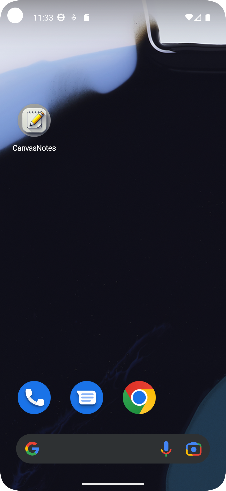
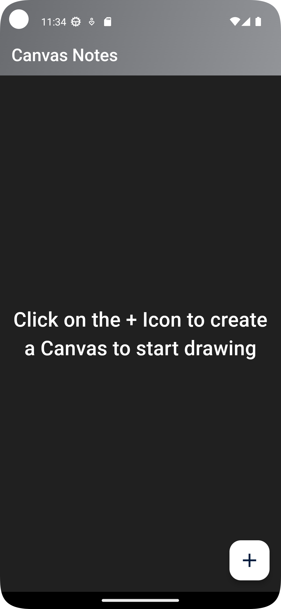
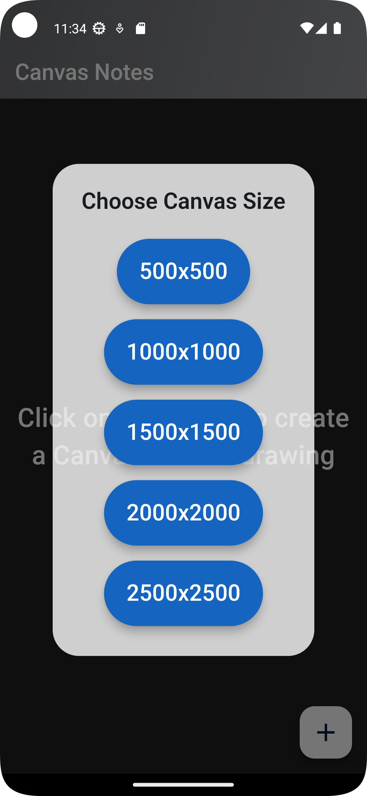
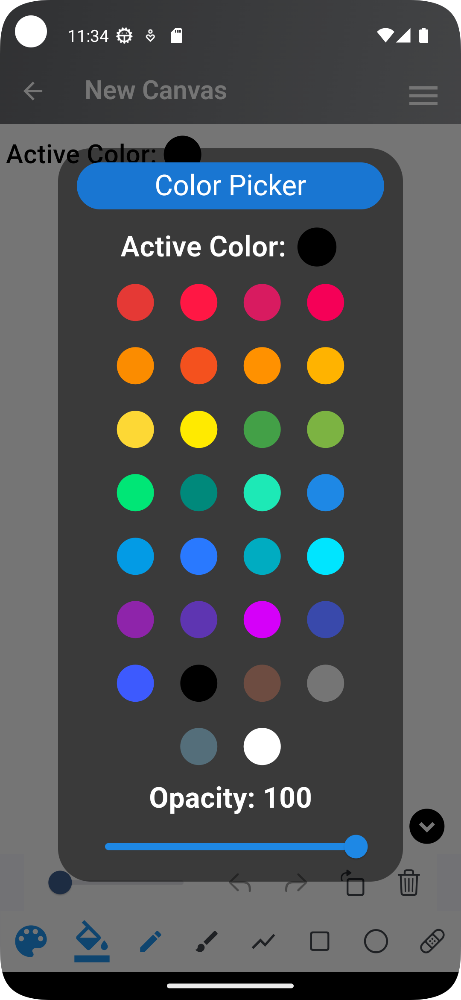
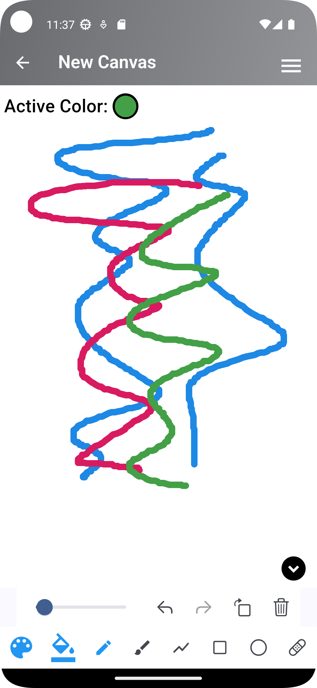
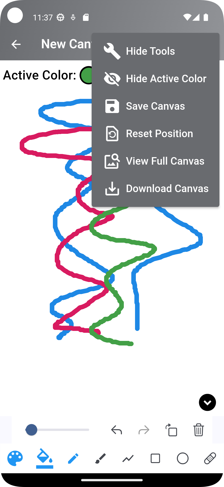
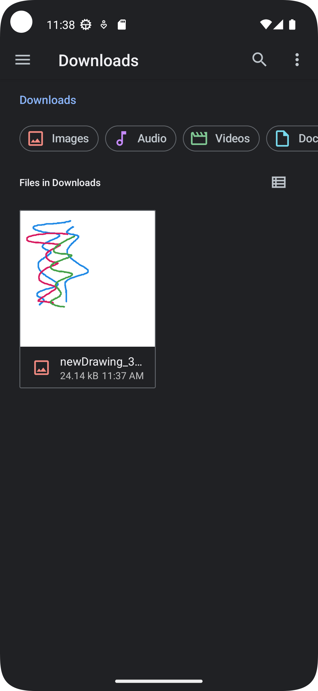
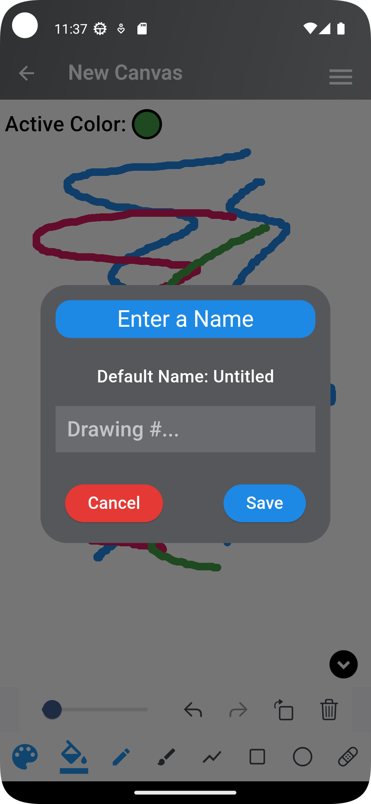
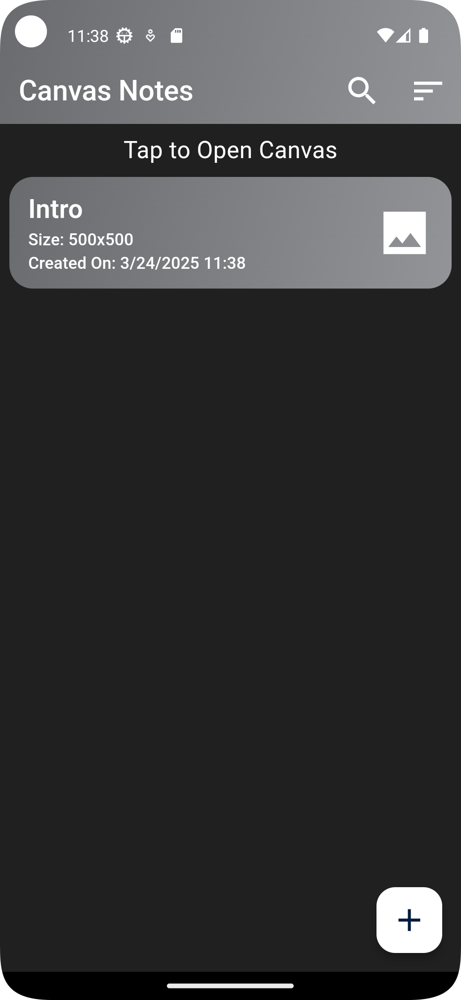

# Canvas Notes - Drawing App

Drawing App created built with Flutter allows users to create, edit, and manage drawings with ease.

## ✨ Features

- 📏 **Canvas Sizes** – Create drawings on different canvas sizes.
- 🎨 **Multi-Color Drawing** – Draw using a variety of colors and adjust opacity.
- 🔳 **Shape Drawing** – Add geometric shapes to your artwork.
- 📥 **Download as PNG** – Save your drawings in PNG format.
- 💾 **Storage & Management** – Store your drawings and manage them effortlessly.
- 🔍 **Search & Sort** – Easily find and organize your saved drawings.

## 📸 Screenshots

### 🏠 Home Screen App Icon

### 🏠 Home Screen

### Choosing Canvas

### 🎨 Color Picker

### ✏️ Example Drawing

### ✏️ Tools

### 📥 Downloaded Drawing

### 💾 Saving Drawing

### ✏️ Drawing List

## 🛠️ Technologies Used
- **Flutter** – Cross-platform UI framework.
- **Dart** – Programming language for Flutter.
- **Permission Handler** – For requesting access to file system.
- **sqflite** – Local storage for drawings.
- **Path Provider** – For accessing the file system.

## Other Dependencies
- **flutter_drawing_board** - Drawing Board with action bar
- **flutter_slidable** - For slidable list items